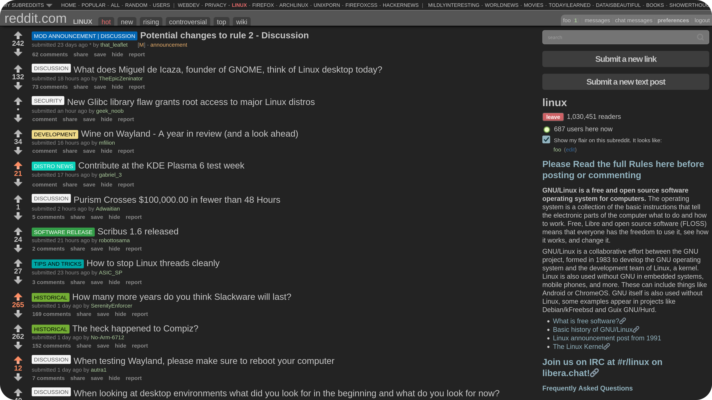

A dark theme for old Reddit.

## Index

- [Features](#features)
- [Installation](#installation)
- [Customization](#customization)

## Features

- **Dark (grayish) theme**, with hints of color borrowed from the famous [Nord palette](https://github.com/nordtheme/nord)
- **Easy to customize** (no CSS knowledge required!)
- **Sticky header** to improve browsing experience
- **Hides**:
  - premium banner
  - new Reddit banner
  - user flair images
  - preview thumbnail
  - expand button
  - ads
  - create subreddit button
  - crosspost button
  - left sidebar
  - ...

### What does Kintsugi mean?

**[Kintsugi](https://en.wikipedia.org/wiki/Kintsugi)** (Japanese: 金継ぎ, "golden joinery"), is the Japanese art of repairing broken pottery by mending the areas of breakage with urushi lacquer dusted or mixed with powdered gold, silver, or platinum. As a philosophy, it treats breakage and repair as part of the history of an object, rather than something to disguise.

## Installation

### Prerequisites

- Mozilla Firefox (Chromium-based browsers are not supported)
- Legacy user profile customizations support enabled:
  1. type `about:config` into your URL bar
  2. click on the **I accept the risk** button, if you're shown a warning
  3. search for `toolkit.legacyUserProfileCustomizations.stylesheets` and set it to `true`
- Custom subreddit themes support disabled:
  1. visit old Reddit and open your [profile settings](https://old.reddit.com/prefs)
  2. uncheck **allow subreddits to show me custom themes**

### Automated (GNU/Linux only)

```bash
cd ~/.mozilla/firefox
cd $(find . -type d -name "*.default-release" -print -quit)
mkdir -p chrome
cd chrome
wget https://github.com/hisutori/kintsugi/releases/latest/download/userContent.css
```

Restart Mozilla Firefox and visit [Reddit](https://old.reddit.com).

### Manual

1. Get the [latest release](https://github.com/hisutori/kintsugi/releases/latest/download/userContent.css)
2. Find your profile directory
   - Open `about:support` in a new tab
   - Find the `Profile Directory` entry
   - Click the `Open Directory` button
   - Create a new directory inside your profile directory called `chrome`
3. Copy downloaded files
   - Copy the `userContent.css` file to the previously created directory
4. Restart Mozilla Firefox and visit [Reddit](https://old.reddit.com)

## Customization

Kintsugi is easy to customize: open the CSS file and edit the hex codes (which correspond to colors) found at the top:

```css
:root {
  --grey1: #c7c7c7;
  --grey2: #747474;
  --grey3: #555;
  --grey4: #3d3d3d;
  --grey5: #232323;
  --blue: #93b4c0;
  --green: #abcb9c;
  --red: #e76b6b;
  --orange: #e8ae6b;
  --yellow: #d3ce9d;
}
```

To see the changes, you must restart your browser.

## Disclaimer

*Reddit*™ is a trademark owned by _Reddit, Inc._,
with which <i>Kintsugi</i> is not affiliated.
